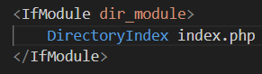
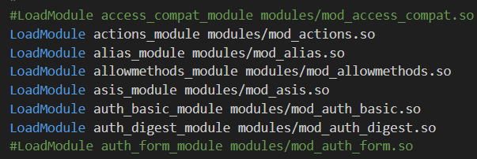
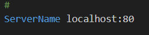
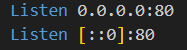
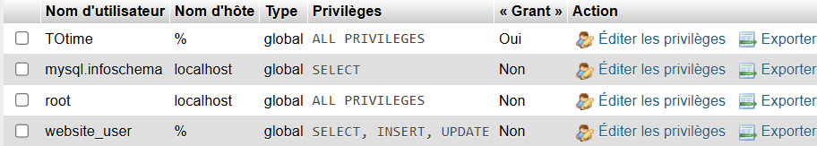
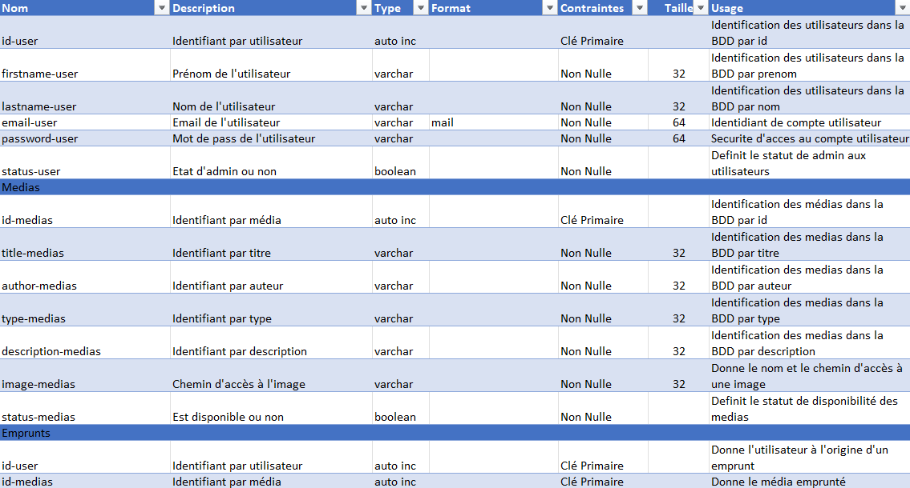

# Rattrapage_web_mediatheque
Le projet vise la réalisation d'une application web permettant la gestion complète d'une médiathèque regroupant des livres, DVD et jeux vidéo. L'application devra disposer d'un Frontend clair et intuitif, un Backend structuré en API REST, et une base de données relationnelle (BDD).


## Installation

**Partie Front-end**
- Installation de composer et de twig comme moteur de template
- Installation d'extensions Snippet HTML CSS JS pour la visibilité
- Installation du live editor pour avoir un apperçu des modifications en direct

**Partie Back-end**
- Installation de Wamp Server 64 3.3.7
    - Installation de Apache 2.4.62.1
    - Installation de PHP 8.3.14
    - Installation de MySQL 9.1.0
    - Installation de PHPmyadmin 5.2


## Configuration

**Wamp Server**
- Configuration de server :
    - les virtual hosts 
    - le httpd.conf pour définir le port sur lequel le server sera host, document root, la redirection par défaut ou encore les modules
    
    
    
    

**PHPmyadmin**
- Creation des utilisateurs avec des privilèges differents pour plus de sécurité : 

    - TOtime : un compte admin avec tous les privilèges et un mdp
    - website_user : un compte utilisateur avec seulement SELECT, INSERT et UPDATE en privilèges et un mdp

- Sécurisation du root avec un mot de passe


## Organisation

**Style**
- Création d'une maquette Figma 
https://www.figma.com/proto/i77g0HxKCzoeSqL1fbiiYo/Web-Rattrapage?page-id=0%3A1&node-id=8-51&p=f&viewport=-36%2C201%2C0.1&t=gTSKsJ55MhXWF2Oe-1&scaling=scale-down&content-scaling=fixed&starting-point-node-id=8%3A51
- Définition d'une charte graphique
- Utilisation de Bulma

**code**

- Le code est architecturé selon le modèle Model View Crontoller mais sous Symfony, ce qui implique des changemments de nom :
    - Les Vues sont dans le folder templates
    - Les Controllers sont dans src/Controller (avec les routes) , dans src/Repository (avec des fonctions permettant la manipulation des données) et dans src/Entity car les class possèdent des methodes get et set pour recuper et changer les données directements intégrés
    - Les Models sont definis dans src/Entity (Doctrine va definir des variables dans la class qui correspondent aux champs des tables)

 (Entity va faire le lien avec la bdd, definir ou garder les champs des tables et proposer des methodes pour recuper les objets associés grâce à doctrine. Tandis que Repository va nous permettre de faire nos propres methodes d'objets afin de réaliser des requettes non pas avec PDO mais avec connection)
 
- Pour la création de la Base De Données, un dictionnaire, un MCD MLD MPD ont été fait pour définir les besoins et le format de la BDD.
   - Dictionnaire de données : 
   
   - [Modeles de Données (en partant du principe qu'un exemplaire d'un media est unique et que si plusieurs personnes empruntent le meme medias ce seront deux medias différents)](imgREADME/Data_Models_mediatheque.pdf)

   - Nous avons donc une BDD avec 4 tables : 
        - user contenant les informations des utilisateur du site
        - medias contenant les informations des médias
        - loan contenant les informations des emprunts réalises
        - history qui est une copie de loan ou on ne peut retirer des éléments

   - Creation des tables avec l'ORM doctrine de Symfony, puis on migre sur le server mySQL (à voir dans migrations/Version20250427162424.php). 

En partant du principe qu'un administrateur est un utilisateur avec des privilèges, un administrateur se connecte avec son compte comme un utilisateur normal, mais aura des accès supplémentaires. Le status admin est définit par le booléen status de la table user.


## Utilisation

**Les clés secrètes sont écrites ici sans sécurité ! Il faut les retirer en cas de véritable mise en production**

**La base de donées mySQL à été vidée**. Il faut être log pour voir son profil, voir ses emprunts ou encore réaliser un emprunt. L'ajout la modification et la suppression des médias se fait avec un compte administrateur. Il n'existe qu'un compte par défaut et c'est un admin avec les logs suivants:

- Email : ``` admin@cesi.fr ```
- Mot de Passe : ``` 4dm1n_p422word ```

Les médias déjà empruntés ne sont pas visibles depuis la page d'acceuil mais seront affichés dans la page de recherche ou si on connais l'identifiant du médias, depuis l'url ```Silmarillion/medias/id```.

La recherche se fait avec la navbar :
- on peut chercher un champ vide pour voir tous les médias
- on peut entrer un champ pour faire une recherhe avancée
- on peut choisir le format de pagination grâce à la selection sur la page de recherche