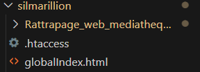

# Rattrapage_web_mediatheque
Le projet vise la réalisation d'une application web permettant la gestion complète d'une médiathèque regroupant des livres, DVD et jeux vidéo. L'application devra disposer d'un Frontend clair et intuitif, d'un Backend structuré en API REST, et d'une base de données relationnelle (BDD).


## Installation

**Partie Front-end**
- Installation de Composer et de Twig comme moteur de template
- Installation d'extensions Snippet HTML CSS JS pour la visibilité
- Installation du live editor pour avoir un aperçu des modifications en direct

**Partie Back-end**
- Installation de Wamp Server 64 3.3.7
    - Installation d'Apache 2.4.62.1
    - Installation de PHP 8.3.14
    - Installation de MySQL 9.1.0
    - Installation de PHPMyAdmin 5.2


## Configuration

**Wamp Server**
- Configuration du serveur :

    - Les virtual hosts 
    - Le httpd.conf pour définir le port sur lequel le serveur sera hébergé, le document root, la redirection par défaut ou encore les modules
    
    
    
    
    - Pour accéder au site en localhost (ou via un appareil connecté au même réseau et connaissant l'adresse IP), le root Directory est Silmarillion.  
    - Lorsque l'on écrit http://localhost/silmarillion ou <adresse_ip>/silmarillion, on tombe sur le globalIndex.html. Un fichier .htaccess permet une redirection permanente vers l'index.php contenu dans /public :
    ```
    RewriteEngine On
    RewriteRule ^$ /silmarillion/Rattrapage_web_mediatheque/public/ [R=301,L]
    ```

**PHPMyAdmin**
- Création des utilisateurs avec des privilèges différents pour plus de sécurité : 

    - TOtime : un compte admin avec tous les privilèges et un mot de passe
    - website_user : un compte utilisateur avec seulement SELECT, INSERT et UPDATE en privilèges et un mot de passe

- Sécurisation du root avec un mot de passe


## Organisation

**Style**
- Création d'une maquette Figma 
https://www.figma.com/proto/i77g0HxKCzoeSqL1fbiiYo/Web-Rattrapage?page-id=0%3A1&node-id=8-51&p=f&viewport=-36%2C201%2C0.1&t=gTSKsJ55MhXWF2Oe-1&scaling=scale-down&content-scaling=fixed&starting-point-node-id=8%3A51
- Définition d'une charte graphique
- Utilisation de Bulma

**Code**

- Le code est architecturé selon le modèle Model View Controller mais sous Symfony, ce qui implique des changements de nom :
    - Les Vues sont dans le dossier templates
    - Les Controllers sont dans src/Controller (avec les routes), dans src/Repository (avec des fonctions permettant la manipulation des données) et dans src/Entity car les classes possèdent des méthodes get et set pour récupérer et changer les données directement intégrées
    - Les Models sont définis dans src/Entity (Doctrine va définir des variables dans la classe qui correspondent aux champs des tables)

 (Entity va faire le lien avec la BDD, définir ou garder les champs des tables et proposer des méthodes pour récupérer les objets associés grâce à Doctrine. Tandis que Repository va nous permettre de créer nos propres méthodes d'objets afin de réaliser des requêtes non pas avec PDO mais avec Connection.)
 
- Pour la création de la Base De Données, un dictionnaire, un MCD, un MLD et un MPD ont été faits pour définir les besoins et le format de la BDD.
   - Dictionnaire de données : 
   
   - [Modèles de Données (en partant du principe qu'un exemplaire d'un média est unique et que si plusieurs personnes empruntent le même média ce seront deux médias différents)](imgREADME/Data_Models_mediatheque.pdf)

   - Nous avons donc une BDD avec 4 tables : 
        - user contenant les informations des utilisateurs du site
        - medias contenant les informations des médias
        - loan contenant les informations des emprunts réalisés
        - history qui est une copie de loan où on ne peut retirer des éléments

   - Création des tables avec l'ORM Doctrine de Symfony, puis migration sur le serveur MySQL (à voir dans migrations/Version20250427162424.php). 

En partant du principe qu'un administrateur est un utilisateur avec des privilèges, un administrateur se connecte avec son compte comme un utilisateur normal, mais aura des accès supplémentaires. Le statut admin est défini par le booléen status de la table user.


## Utilisation

**Les clés secrètes sont écrites ici sans sécurité ! Il faut les retirer en cas de véritable mise en production**

**La base de données MySQL a été vidée**. Il faut être connecté pour voir son profil, voir ses emprunts ou encore réaliser un emprunt. L'ajout, la modification et la suppression des médias se fait avec un compte administrateur. Il n'existe qu'un compte par défaut et c'est un admin avec les identifiants suivants :

- Email : ``` admin@cesi.fr ```
- Mot de Passe : ``` 4dm1n_p422w0rd ```

Les médias déjà empruntés ne sont pas visibles depuis la page d'accueil mais seront affichés dans la page de recherche ou, si on connaît l'identifiant du média, depuis l'URL ```Silmarillion/medias/id```.

La recherche se fait avec la navbar :
- On peut chercher un champ vide pour voir tous les médias
- On peut entrer un champ pour faire une recherche avancée
- On peut choisir le format de pagination grâce à la sélection sur la page de recherche


## Pour la partie API, voir sur les deux autres releases ou directement sur le github : https://github.com/fvancamp5/Silmarillion