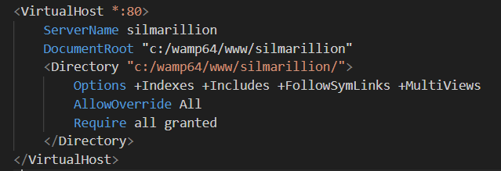

# Rattrapage_web_mediatheque
Le projet vise la réalisation d'une application web permettant la gestion complète d'une médiathèque regroupant des livres, DVD et jeux vidéo. L'application devra disposer d'un Frontend clair et intuitif, un Backend structuré en API REST, et une base de données relationnelle (BDD).

## Installation

**Partie Front-end**
- Installation de composer et de twig comme moteur de template
- Installation d'extensions Snippet HTML CSS JS pour la visibilité
- Installation du live editor pour avoir un apperçu des modifications en direct

**Partie Back-end**
- Installation de Wamp Server 64 3.3.7
    - Installation de Apache 2.4.62.1
    - Installation de PHP 8.3.14
    - Installation de MySQL 9.1.0
    - Installation de PHPmyadmin 5.2

## Configuration

**Wamp Server**
- Configuration de server :
    - les virtual hosts 
    - le httpd.conf pour définir le port sur lequel le server sera host, document root, la redirection par défaut ou encore les modules
    
    
    
    

**PHPmyadmin**
- Creation des utilisateurs avec des privilèges differents pour plus de sécurité : 

    - TOtime : un compte admin avec tous les privilèges et un mdp
    - website_user : un compte utilisateur avec seulement SELECT, INSERT et UPDATE en privilèges et un mdp

- Sécurisation du root avec un mot de passe

## Organisation

**Style**
- Création d'une maquette Figma 
https://www.figma.com/proto/i77g0HxKCzoeSqL1fbiiYo/Web-Rattrapage?page-id=0%3A1&node-id=8-51&p=f&viewport=-36%2C201%2C0.1&t=gTSKsJ55MhXWF2Oe-1&scaling=scale-down&content-scaling=fixed&starting-point-node-id=8%3A51
- Définition d'une charte graphique
- Utilisation de Bulma

**code**

- Le code est architecturé selon le modèle Model View Crontoller 
- Pour la création de la Base De Données, un dictionnaire, un MCD MLD MPD ont été fait pour définir les besoins et le format de la BDD.
   - Dictionnaire de données : 
   
   - [Modeles de Données (en partant du principe qu'un exemplaire d'un media est unique et que si plusieurs personnes empruntent le meme medias ce seront deux medias différents)](imgREADME/Data_Models_mediatheque.pdf)

- Elle est faite sur un SQLserver créé depuis PHPmyadmin

